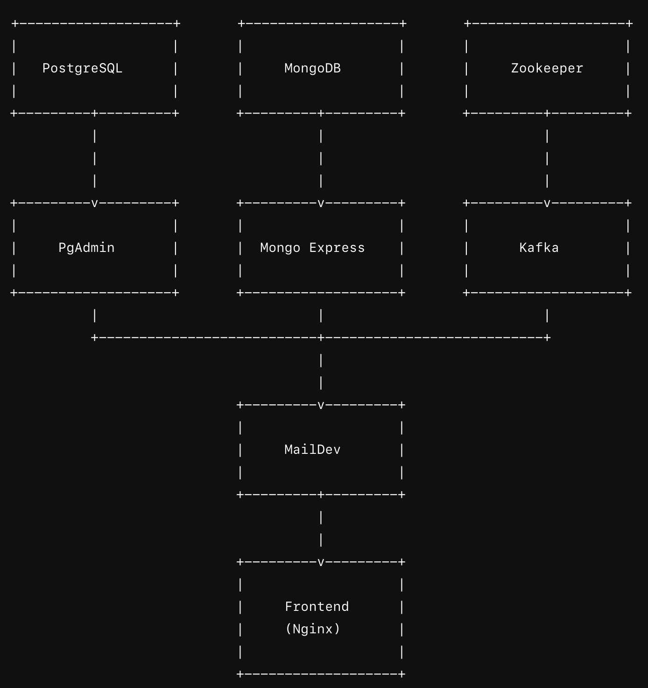

# Sri Tel - New Customer Experience (Sri-Care)

This repository contains the source code and documentation for the "Sri-Care" web portal and smartphone apps developed as part of the Middleware Architectures course [IS3108/SCS3203] Assignment 2.

## Project Overview

**Sri-Care** is a customer care solution for Sri Tel Ltd (STL), a telecommunications company in Sri Lanka. The solution aims to improve customer experience by offering services through a web portal and mobile apps (iOS and Android) that allow users to manage services, view and pay bills, receive notifications, and chat with customer care agents.

### Key Features

1. **Account Creation & Management**:
    - Secure online account registration for existing customers.
    - Password recovery and change options.

2. **Service Management**:
    - Activate or deactivate telco services like international roaming, data top-ups, and other value-added services (VAS).

3. **Billing & Payments**:
    - View current and past bills.
    - Make online payments using credit/debit cards through an external payment gateway.

4. **Notifications**:
    - Receive email/SMS/push alerts on bills, service issues, and disconnections.
    - Alerts are managed in a way that does not disrupt the system's performance during peak times.

5. **Customer Care Chat**:
    - An architecture for an instant messaging system between customers and care agents.

## Architecture Overview

The solution leverages middleware architecture to implement RESTful services for core functionalities, including:
- **Provisioning System**: Exposes RESTful APIs to manage telco services.
- **Payment Gateway**: Handles secure credit/debit card payments.

While only a minimal prototype is implemented, the architecture is designed to scale for web and mobile platforms (iOS and Android).
## Technologies and Frameworks
- **Frontend**: HTML, CSS, JavaScript
- **Backend**: Java, Spring Boot
- **Database**: PostgreSQL, MongoDB
- **Messaging**: Kafka, Zookeeper
- **Other Services**: PgAdmin, Mongo Express, MailDev
- **Containerization**: Docker, Docker Compose

## Microservices Architecture
The project is divided into several microservices, each running in its own Docker container:
- **PostgreSQL**: Relational database for storing structured data.
- **PgAdmin**: Web-based interface for managing PostgreSQL databases.
- **MongoDB**: NoSQL database for storing unstructured data.
- **Mongo Express**: Web-based interface for managing MongoDB databases.
- **Zookeeper**: Centralized service for maintaining configuration information and providing distributed synchronization.
- **Kafka**: Distributed messaging system for building real-time data pipelines and streaming applications.
- **MailDev**: SMTP server for development and testing of email sending.
- **Frontend**: Nginx server serving the static HTML/CSS/JavaScript files.

## Architecture Overview


## Setup and Running the Project
To set up and run the project, follow these steps:

1. **Clone the repository**:
    ```sh
    git clone <repository-url>
    cd sricareweb
    ```

2. **Create a `.env` file** in the root directory and add the following environment variables:
    ```env
    PGADMIN_DEFAULT_EMAIL=pgadmin4@pgadmin.org
    PGADMIN_DEFAULT_PASSWORD=admin
    ```

3. **Run Docker Compose**:
    ```sh
    docker-compose up
    ```

4. **Access the services**:
    - **Frontend**: [http://localhost:6203](http://localhost:6203)
    - **PgAdmin**: [http://localhost:5050](http://localhost:5050)
    - **Mongo Express**: [http://localhost:8081](http://localhost:8081)
    - **MailDev**: [http://localhost:1080](http://localhost:1080)

## Docker Compose Configuration
The `docker-compose.yml` file defines the configuration for all the services. Key points include:
- **Volumes**: Persistent storage for PostgreSQL and MongoDB data.
- **Networks**: Bridge network for inter-service communication.
- **Ports**: Port mappings for accessing services from the host machine.

## Additional Information
- **PostgreSQL**:
    - Username: `postgres`
    - Data Directory: `/data/postgres`

- **MongoDB**:
    - Root Username: `root`
    - Data Directory: `/data`

- **Kafka**:
    - Zookeeper Connection: `zookeeper:2181`
    - Advertised Listeners: `PLAINTEXT://localhost:9092`

## License
This project is licensed under the MIT License.

## Group Members
- B.D.I.C. Wanigarathne - 2100261
- P.R.C.K. Polgampala - 21001391
- S.R. Nagahawatta - 21001243
- P.L.R. Sathnindu - 21001774
- W.G.L. Geesilu - 21000702
- D W DE HOEDT - 21000379